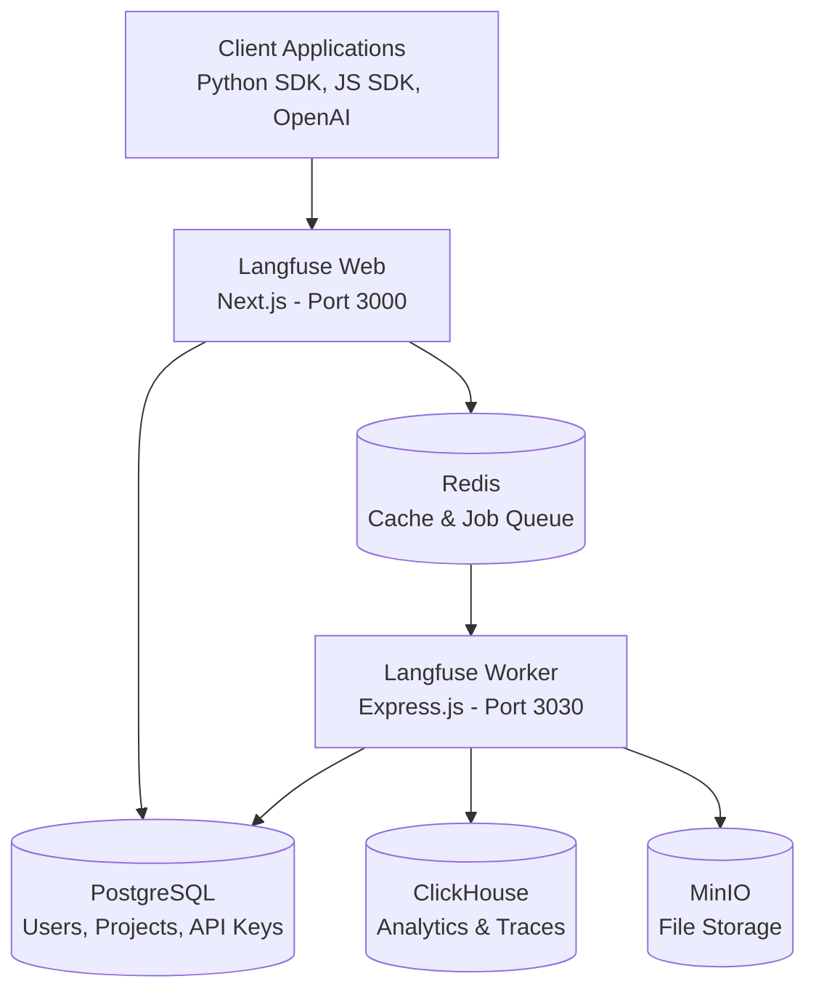

# 📊 Monitor - Langfuse 3.0 LLM Observability Platform

This directory contains a complete Docker Compose deployment for **Langfuse 3.0**, an open-source LLM observability platform that provides comprehensive monitoring, tracing, and evaluation capabilities for AI applications.

## 🎯 What is Langfuse?

Langfuse is a powerful observability platform designed for Large Language Model (LLM) applications. It offers:

- **🔍 LLM Tracing & Debugging** - Track all LLM calls and application logic with detailed traces
- **📝 Prompt Management** - Version control, collaborate, and manage prompts centrally
- **⚡ Evaluations** - LLM-as-judge, manual labeling, and custom evaluation pipelines
- **📊 Datasets & Benchmarks** - Test sets for validation and performance tracking
- **🎮 Interactive Playground** - Test and iterate on prompts with real-time feedback
- **📈 Analytics Dashboard** - Monitor usage, costs, and performance metrics

## 📁 Directory Structure

```
monitor/
├── README.md                     # This file
├── langfuse.compose.yml          # Docker Compose configuration (600+ lines)
├── .env.langfuse.example         # Environment template (200+ lines)
└── docs/
    ├── LANGFUSE_DEPLOYMENT.md    # Comprehensive deployment guide (800+ lines)
    ├── LANGFUSE_GETTING_STARTED.md
    ├── LANGFUSE_PACKAGE_SUMMARY.md
    └── LANGFUSE_QUICKREF.md      # Quick reference for common tasks
```

## 🚀 Quick Start (5 Minutes)

### Prerequisites

- Docker & Docker Compose installed
- At least 4GB RAM available
- At least 10GB disk space
- Ports 3000, 3030, 5432, 8123, 6379, 9000 available

### Step 1: Prepare Environment

```bash
cd d:\Project\ai4team\monitor
cp .env.langfuse.example .env
```

### Step 2: Configure (Optional)

Edit `.env` file with your custom settings:

```env
# Database passwords (change in production!)
POSTGRES_PASSWORD=your-secure-password
CLICKHOUSE_PASSWORD=your-secure-password  
REDIS_PASSWORD=your-secure-password

# Application settings
NEXTAUTH_SECRET=your-secret-min-32-characters
NEXTAUTH_URL=http://localhost:3000

# Disable public signups (optional)
NEXT_PUBLIC_SIGN_UP_DISABLED=false
```

### Step 3: Start Services

```bash
docker compose -f langfuse.compose.yml up -d
```

### Step 4: Wait for Initialization

```bash
# Monitor startup logs
docker compose -f langfuse.compose.yml logs -f langfuse-web
# Wait for: "ready started server on 0.0.0.0:3000"
```

### Step 5: Access Langfuse

- **Web UI**: http://localhost:3000
- **MinIO Console**: http://localhost:9001 (minioadmin/minioadmin123)

### Step 6: First Setup

1. Sign up for a new account
2. Create your first project
3. Go to Settings → API Keys
4. Generate and copy your API keys (`pk-lf-...` and `sk-lf-...`)

## 🏗️ Architecture Overview

The deployment includes 6 core services:

| Service | Purpose | Port | Technology |
|---------|---------|------|------------|
| **Langfuse Web** | Frontend UI + REST/tRPC APIs | 3000 | Next.js 14 |
| **Langfuse Worker** | Background job processing | 3030 | Express.js + BullMQ |
| **PostgreSQL** | Primary database (users, projects, API keys) | 5432 | PostgreSQL 16 |
| **ClickHouse** | Analytics database (traces, metrics) | 8123 | ClickHouse |
| **Redis** | Cache & job queue system | 6379 | Redis 7 |
| **MinIO** | S3-compatible object storage | 9000 | MinIO |



## 🔧 Common Operations

### Start/Stop Services

```bash
# Start all services
docker compose -f langfuse.compose.yml up -d

# Stop services (keep data)
docker compose -f langfuse.compose.yml down

# Stop and remove all data (⚠️ DESTRUCTIVE)
docker compose -f langfuse.compose.yml down -v

# Restart specific service
docker compose -f langfuse.compose.yml restart langfuse-web
```

### View Logs

```bash
# All services
docker compose -f langfuse.compose.yml logs -f

# Specific service
docker compose -f langfuse.compose.yml logs -f langfuse-web

# Search for errors
docker compose -f langfuse.compose.yml logs | grep -i error
```

### Scale Workers

```bash
# Scale to 3 worker instances for higher throughput
docker compose -f langfuse.compose.yml up -d --scale langfuse-worker=3
```

### Database Access

```bash
# PostgreSQL
docker compose -f langfuse.compose.yml exec postgres psql -U langfuse -d langfuse

# ClickHouse
docker compose -f langfuse.compose.yml exec clickhouse clickhouse-client
```

## 🔌 Integration Examples

### Python with OpenAI

```python
from langfuse.openai import openai

# Configure with your API keys
openai.configure(
    public_key="pk-lf-...",
    secret_key="sk-lf-...",
    host="http://localhost:3000"
)

# All calls automatically traced
response = openai.chat.completions.create(
    model="gpt-4",
    messages=[{"role": "user", "content": "Hello, world!"}]
)
```

### Python with LangChain

```python
from langfuse.callback import CallbackHandler

handler = CallbackHandler(
    public_key="pk-lf-...",
    secret_key="sk-lf-...",
    host="http://localhost:3000"
)

# Add to any LangChain chain
chain.invoke(
    {"input": "What is the capital of France?"}, 
    config={"callbacks": [handler]}
)
```

### Direct Python SDK

```python
from langfuse import Langfuse

langfuse = Langfuse(
    public_key="pk-lf-...",
    secret_key="sk-lf-...",
    host="http://localhost:3000"
)

# Create a trace
trace = langfuse.trace(name="my-llm-app")

# Add spans
span = trace.span(name="retrieval")
span.end()

generation = trace.generation(
    name="openai-completion",
    model="gpt-4",
    input="Hello",
    output="Hi there!"
)
```

## 🔒 Security Considerations

### Development Environment
- Default passwords are used for convenience
- All services exposed on localhost
- SignUp enabled by default

### Production Recommendations
1. **Change all default passwords** in `.env`
2. **Generate secure secrets**: `openssl rand -base64 32`
3. **Use HTTPS** with valid SSL certificates
4. **Disable public signups**: `NEXT_PUBLIC_SIGN_UP_DISABLED=true`
5. **Use managed databases** (AWS RDS, Azure Database)
6. **Implement network restrictions** and firewall rules
7. **Enable backup strategies** for data persistence

## 📊 Monitoring & Observability

### Health Checks

```bash
# Check service status
docker compose -f langfuse.compose.yml ps

# View health check logs
docker compose -f langfuse.compose.yml logs | grep health
```

### Performance Monitoring

```bash
# Container resource usage
docker stats

# Database performance
docker compose -f langfuse.compose.yml exec postgres pg_stat_activity
```

### Backup & Recovery

```bash
# Backup PostgreSQL
docker compose -f langfuse.compose.yml exec postgres pg_dump -U langfuse langfuse | gzip > backup.sql.gz

# Restore PostgreSQL
gunzip -c backup.sql.gz | docker compose -f langfuse.compose.yml exec -T postgres psql -U langfuse -d langfuse
```

## 🚨 Troubleshooting

### Common Issues

| Problem | Solution |
|---------|----------|
| Port already in use | Change ports in `.env` file |
| Database connection error | Check `DATABASE_URL` and credentials |
| MinIO bucket creation failed | Verify MinIO console at http://localhost:9001 |
| High memory usage | Scale Redis or reduce trace retention |
| Worker queue backing up | Scale worker instances |

### Debug Commands

```bash
# Check container health
docker compose -f langfuse.compose.yml ps

# Inspect specific service
docker compose -f langfuse.compose.yml logs --tail=100 langfuse-web

# Network connectivity test
docker compose -f langfuse.compose.yml exec langfuse-web ping postgres
```

## 📚 Documentation

For comprehensive documentation, see:

- **[LANGFUSE_DEPLOYMENT.md](docs/LANGFUSE_DEPLOYMENT.md)** - Complete deployment guide (800+ lines)
- **[LANGFUSE_QUICKREF.md](docs/LANGFUSE_QUICKREF.md)** - Quick reference for common tasks
- **[LANGFUSE_PACKAGE_SUMMARY.md](docs/LANGFUSE_PACKAGE_SUMMARY.md)** - Complete feature overview

### External Resources

- **Official Docs**: https://langfuse.com/docs
- **Self-Hosting Guide**: https://langfuse.com/docs/deployment/self-host
- **GitHub Repository**: https://github.com/langfuse/langfuse
- **Discord Community**: https://discord.com/invite/7NXusRtqYU
- **API Reference**: https://langfuse.com/docs/api

## 🛣️ Roadmap & Integration

This Langfuse deployment integrates with other AI4Team components:

- **LLM Service** (`../llm/`) - LiteLLM proxy with Langfuse tracing
- **Guardrails** (`../guardrails/`) - Content filtering with observability
- **Knowledge Base** (`../knowledgebase/`) - RAG system monitoring
- **Reranker** (`../reranker/`) - Search result optimization tracking

## 🎯 Use Cases

### Development
- Debug LLM application flows
- Test prompt variations
- Monitor token usage and costs
- Evaluate model performance

### Production
- Track user interactions
- Monitor system performance  
- Detect anomalies and errors
- Analyze usage patterns

### Research & Evaluation
- Compare model outputs
- Create evaluation datasets
- Run A/B tests on prompts
- Measure quality metrics

## 📈 Performance & Scaling

### Expected Performance

| Scenario | Traces/sec | Worker Instances | DB Requirements |
|----------|------------|------------------|-----------------|
| Development | 10-100 | 1 | Local containers |
| Small Production | 100-1,000 | 2-3 | Managed databases |
| Enterprise | 1,000+ | 5+ | Database clusters |

### Storage Requirements

- **PostgreSQL**: ~1GB per 100K API keys
- **ClickHouse**: ~1GB per 1M traces  
- **Redis**: ~50MB per 1M jobs
- **MinIO**: Varies by trace media content

---

## 🚀 Get Started

Ready to monitor your LLM applications? 

1. **Clone and configure**: Copy `.env.langfuse.example` to `.env`
2. **Start services**: `docker compose -f langfuse.compose.yml up -d`
3. **Access UI**: http://localhost:3000
4. **Read the guides**: Start with `docs/LANGFUSE_QUICKREF.md`
5. **Integrate**: Use the Python/JS SDK examples above

For production deployment, consult `docs/LANGFUSE_DEPLOYMENT.md` for comprehensive setup instructions.

---

**Langfuse 3.0 Monitor Package**  
Part of AI4Team Platform  
October 2025