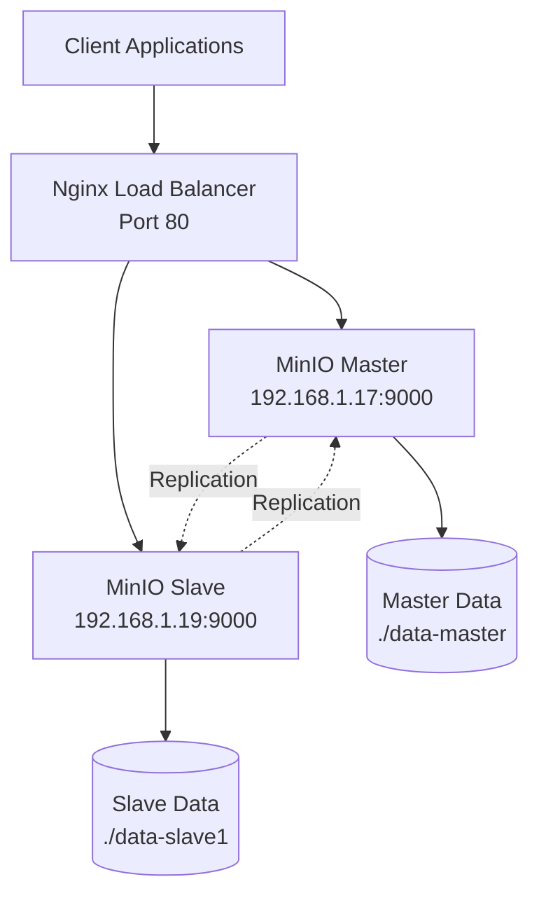

# 🗄️ S3 - MinIO Distributed Object Storage

This directory contains a complete MinIO distributed object storage deployment for the AI4Team platform, providing S3-compatible storage across multiple nodes for high availability and scalability.

## 🎯 What is MinIO?

MinIO is a high-performance, S3-compatible object storage system designed for cloud-native applications. It provides:

- **🔄 Distributed Storage** - Automatic data replication across nodes
- **⚡ High Performance** - Multi-threaded, optimized for modern hardware
- **🔒 Enterprise Security** - Encryption at rest and in transit
- **📊 S3 Compatibility** - Drop-in replacement for Amazon S3
- **🎛️ Management Console** - Web-based administration interface
- **🚀 Scalability** - Horizontal scaling across multiple servers

## 📁 Directory Structure

```
s3/
├── README.md                 # This file
├── master.compose.yml        # Master node Docker Compose configuration
├── slave.compose.yml         # Slave node Docker Compose configuration
├── minio.sh                  # Shell script for flexible deployment
└── s3.conf                   # Nginx load balancer configuration
```

## 🏗️ Architecture Overview

The MinIO deployment consists of:

### **Distributed Setup**
- **Master Node** (minio-master): Primary node with console access
- **Slave Node(s)** (minio-slave1): Additional storage nodes
- **Load Balancer**: Nginx proxy for high availability

### **Network Configuration**


### **Port Mapping**

| Service | Host Port | Container Port | Purpose |
|---------|-----------|----------------|---------|
| Master API | 9000 | 9000 | S3 API endpoint |
| Master Console | 9002 | 9001 | Web management UI |
| Slave API | 9000 | 9000 | S3 API endpoint |
| Slave Console | 9001 | 9001 | Web management UI |
| Nginx LB | 80 | - | Load balanced access |

## 🚀 Quick Start

### Prerequisites

- Docker & Docker Compose installed
- Network connectivity between master and slave nodes
- At least 4GB RAM per node
- Sufficient disk space for data storage

### Option 1: Docker Compose Deployment

#### Step 1: Configure Network

Edit IP addresses in the compose files to match your network:

**master.compose.yml:**
```yaml
extra_hosts:
  - "minio-slave1:192.168.1.19"   # Update with slave IP
```

**slave.compose.yml:**
```yaml
extra_hosts:
  - "minio-master:192.168.1.17"   # Update with master IP
```

#### Step 2: Deploy Master Node

```bash
# On master server (192.168.1.17)
cd d:\Project\ai4team\s3

# Set environment variables
export MINIO_ROOT_USER=minioadmin
export MINIO_ROOT_PASSWORD=your-secure-password

# Start master node
docker-compose -f master.compose.yml up -d
```

#### Step 3: Deploy Slave Node

```bash
# On slave server (192.168.1.19)
cd /path/to/s3

# Set same credentials
export MINIO_ROOT_USER=minioadmin
export MINIO_ROOT_PASSWORD=your-secure-password

# Start slave node
docker-compose -f slave.compose.yml up -d
```

### Option 2: Shell Script Deployment

The `minio.sh` script provides flexible deployment options:

#### Single Node Setup
```bash
./minio.sh --name minio-single --my-name minio-single
```

#### Distributed Cluster Setup
```bash
# On master node
./minio.sh --name master --my-name minio-master \
           --add-host minio-slave1:192.168.1.19 \
           --join minio-slave1

# On slave node
./minio.sh --name slave1 --my-name minio-slave1 \
           --add-host minio-master:192.168.1.17 \
           --join minio-master
```

#### Custom Configuration
```bash
./minio.sh --name custom-minio \
           --my-name node-1 \
           --port 9500 \
           --dashboard-port 9501 \
           --access myadmin \
           --secret mysecretpassword \
           --data-dir /custom/data/path \
           --join node-2 node-3
```

## ⚖️ Load Balancer Setup

Configure Nginx to load balance across MinIO nodes:

### Step 1: Install Nginx

```bash
# Ubuntu/Debian
sudo apt update && sudo apt install nginx

# CentOS/RHEL
sudo yum install nginx
```

### Step 2: Configure Load Balancer

```bash
# Copy configuration
sudo cp s3.conf /etc/nginx/conf.d/minio.conf

# Update server name and IPs in the config
sudo nano /etc/nginx/conf.d/minio.conf
```

### Step 3: Start Nginx

```bash
# Test configuration
sudo nginx -t

# Start/reload Nginx
sudo systemctl restart nginx
```

## 🔧 Configuration Options

### Environment Variables

| Variable | Default | Description |
|----------|---------|-------------|
| `MINIO_ROOT_USER` | minioadmin | MinIO access key |
| `MINIO_ROOT_PASSWORD` | miniopassword | MinIO secret key |
| `MINIO_BROWSER` | on | Enable web console |
| `MINIO_DOMAIN` | - | Domain for virtual-host-style requests |
| `MINIO_SERVER_URL` | - | External URL for the server |

### Volume Configuration

```yaml
volumes:
  - ./data-master:/data        # Local directory mount
  # OR
  - /mnt/storage:/data         # External storage mount
  # OR  
  - minio-data:/data           # Docker volume
```

### Network Hosts Configuration

Update `extra_hosts` sections with actual IP addresses:

```yaml
extra_hosts:
  - "minio-slave1:192.168.1.19"    # Slave node IP
  - "minio-slave2:192.168.1.20"    # Additional slaves
  - "minio-slave3:192.168.1.21"
```

## 🔒 Security Configuration

### Access Credentials

```bash
# Generate secure credentials
export MINIO_ROOT_USER=$(openssl rand -hex 16)
export MINIO_ROOT_PASSWORD=$(openssl rand -hex 32)

# Save credentials securely
echo "MINIO_ROOT_USER=${MINIO_ROOT_USER}" > .env
echo "MINIO_ROOT_PASSWORD=${MINIO_ROOT_PASSWORD}" >> .env
```

### SSL/TLS Setup

```bash
# Generate self-signed certificate (development)
mkdir -p ./certs
openssl req -new -x509 -days 365 -nodes \
  -out ./certs/public.crt \
  -keyout ./certs/private.key \
  -subj "/C=VN/ST=HCM/L=HCM/O=AI4Team/CN=s3.ai4team.vn"

# Update compose with SSL mount
volumes:
  - ./data-master:/data
  - ./certs:/root/.minio/certs
```

### Firewall Configuration

```bash
# Allow MinIO ports
sudo ufw allow 9000/tcp    # API
sudo ufw allow 9001/tcp    # Console
sudo ufw allow 80/tcp      # Load balancer

# Restrict to specific networks (production)
sudo ufw allow from 192.168.1.0/24 to any port 9000
```

## 🛠️ Common Operations

### Check Cluster Status

```bash
# View container status
docker ps

# Check logs
docker-compose -f master.compose.yml logs -f
docker-compose -f slave.compose.yml logs -f

# MinIO admin commands (from container)
docker exec minio-master mc admin info minio-cluster
```

### Create Buckets

```bash
# Using MinIO Client (mc)
docker exec minio-master mc mb minio-cluster/my-bucket

# Using curl (S3 API)
curl -X PUT http://localhost:9000/my-bucket \
  -H "Authorization: AWS4-HMAC-SHA256 ..."
```

### Backup and Restore

```bash
# Backup data
tar -czf minio-backup-$(date +%Y%m%d).tar.gz ./data-master ./data-slave1

# Restore data (stop services first)
docker-compose -f master.compose.yml down
docker-compose -f slave.compose.yml down
tar -xzf minio-backup-20241031.tar.gz
# Start services
```

### Scale the Cluster

```bash
# Add new slave node
./minio.sh --name slave2 --my-name minio-slave2 \
           --port 9010 --dashboard-port 9011 \
           --add-host minio-master:192.168.1.17 \
           --add-host minio-slave1:192.168.1.19 \
           --join minio-master minio-slave1
```

## 📊 Monitoring & Management

### Access Web Consoles

- **Master Console**: http://192.168.1.17:9002
- **Slave Console**: http://192.168.1.19:9001
- **Load Balanced**: http://s3.ai4team.vn (via Nginx)

### Performance Monitoring

```bash
# Container resource usage
docker stats minio-master minio-slave1

# Disk usage
df -h ./data-master ./data-slave1

# Network connectivity test
docker exec minio-master ping minio-slave1
```

### Health Checks

```bash
# API health check
curl http://localhost:9000/minio/health/live

# Cluster health
docker exec minio-master mc admin heal minio-cluster
```

## 🔌 Integration Examples

### Python (boto3)

```python
import boto3

# Configure S3 client for MinIO
s3_client = boto3.client(
    's3',
    endpoint_url='http://s3.ai4team.vn',
    aws_access_key_id='minioadmin',
    aws_secret_access_key='your-secure-password',
    region_name='us-east-1'
)

# Create bucket
s3_client.create_bucket(Bucket='my-app-bucket')

# Upload file
s3_client.upload_file('local-file.txt', 'my-app-bucket', 'remote-file.txt')

# Download file
s3_client.download_file('my-app-bucket', 'remote-file.txt', 'downloaded-file.txt')
```

### Node.js (aws-sdk)

```javascript
const AWS = require('aws-sdk');

// Configure S3 for MinIO
const s3 = new AWS.S3({
    endpoint: 'http://s3.ai4team.vn',
    accessKeyId: 'minioadmin',
    secretAccessKey: 'your-secure-password',
    s3ForcePathStyle: true,
    signatureVersion: 'v4'
});

// List buckets
s3.listBuckets((err, data) => {
    if (err) console.log(err);
    else console.log(data.Buckets);
});

// Upload object
const uploadParams = {
    Bucket: 'my-app-bucket',
    Key: 'my-object.json',
    Body: JSON.stringify({ message: 'Hello MinIO!' })
};

s3.upload(uploadParams, (err, data) => {
    if (err) console.log(err);
    else console.log('Upload Success:', data.Location);
});
```

### MinIO Client (mc)

```bash
# Configure alias
docker exec minio-master mc alias set cluster http://localhost:9000 minioadmin your-secure-password

# List buckets
docker exec minio-master mc ls cluster

# Copy files
docker exec minio-master mc cp /tmp/myfile.txt cluster/my-bucket/

# Mirror directories
docker exec minio-master mc mirror /data/source cluster/my-bucket/destination
```

## 🚨 Troubleshooting

### Common Issues

| Problem | Symptoms | Solution |
|---------|----------|----------|
| Nodes can't connect | Cluster formation fails | Check IP addresses in extra_hosts |
| Port conflicts | Container won't start | Update port mappings |
| Permission denied | Volume mount errors | Check directory ownership/permissions |
| High memory usage | OOM kills | Increase container memory limits |
| Slow performance | High latency | Check network bandwidth, disk I/O |

### Debug Commands

```bash
# Check container logs
docker-compose -f master.compose.yml logs --tail=50 minio-master

# Network connectivity
docker exec minio-master telnet minio-slave1 9000

# Disk space
docker exec minio-master df -h /data

# Process status
docker exec minio-master ps aux

# MinIO server info
docker exec minio-master mc admin info minio-cluster
```

### Performance Tuning

#### Disk Optimization
```bash
# For SSDs, disable write cache
echo noop | sudo tee /sys/block/sda/queue/scheduler

# Increase file descriptors
echo "fs.file-max = 1048576" >> /etc/sysctl.conf
sysctl -p
```

#### Network Optimization
```bash
# Increase network buffers
echo 'net.core.rmem_max = 268435456' >> /etc/sysctl.conf
echo 'net.core.wmem_max = 268435456' >> /etc/sysctl.conf
sysctl -p
```

#### Container Limits
```yaml
services:
  minio-master:
    # Add resource limits
    mem_limit: 2g
    memswap_limit: 2g
    cpus: 2.0
```

## 🔗 Integration with AI4Team Platform

This MinIO S3 storage integrates with other AI4Team components:

- **Knowledge Base** (`../knowledgebase/`) - Document and vector storage
- **Monitor** (`../monitor/`) - Langfuse trace and media storage  
- **LLM** (`../llm/`) - Model cache and temporary file storage
- **Guardrails** (`../guardrails/`) - Configuration and log storage
- **Reranker** (`../reranker/`) - Index and model artifact storage

### Environment Integration

```bash
# Set S3 endpoint for other services
export S3_ENDPOINT=http://s3.ai4team.vn
export S3_ACCESS_KEY=minioadmin
export S3_SECRET_KEY=your-secure-password
export S3_BUCKET_PREFIX=ai4team
```

## 📋 Production Deployment Checklist

### Security
- [ ] Change default credentials
- [ ] Enable SSL/TLS encryption
- [ ] Configure firewall rules
- [ ] Set up access policies
- [ ] Enable audit logging

### High Availability
- [ ] Deploy multiple nodes (minimum 2)
- [ ] Configure load balancer
- [ ] Set up health checks
- [ ] Plan disaster recovery
- [ ] Test failover scenarios

### Performance
- [ ] Size storage appropriately
- [ ] Configure memory limits
- [ ] Optimize network settings
- [ ] Set up monitoring
- [ ] Plan capacity scaling

### Backup & Recovery
- [ ] Automated backup schedule
- [ ] Off-site backup storage
- [ ] Test restore procedures
- [ ] Document recovery process
- [ ] Monitor backup integrity

## 📚 Documentation & Resources

### Official MinIO Documentation
- **MinIO Docs**: https://docs.min.io/
- **Docker Deployment**: https://docs.min.io/docs/deploy-minio-on-docker-compose.html
- **Distributed Setup**: https://docs.min.io/docs/distributed-minio-quickstart-guide.html
- **Client SDKs**: https://docs.min.io/docs/golang-client-api-reference.html

### AI4Team Platform Docs
- **Monitor Integration**: `../monitor/README.md`
- **Knowledge Base**: `../knowledgebase/README.md`
- **LLM Service**: `../llm/README.md`

## 📈 Scaling Strategies

### Horizontal Scaling
```bash
# Add nodes dynamically (requires restart)
# Update compose files with new nodes
# Restart cluster with new configuration
```

### Vertical Scaling
```yaml
# Increase container resources
services:
  minio-master:
    mem_limit: 8g
    cpus: 4.0
```

### Storage Scaling
```bash
# Add additional volumes
volumes:
  - ./data-master:/data1
  - /mnt/storage2:/data2
  - /mnt/storage3:/data3

# Update command to use multiple drives
command: server --console-address ":9001" /data1 /data2 /data3
```

---

## 🚀 Get Started

Ready to deploy MinIO distributed storage?

1. **Configure network**: Update IP addresses in compose files
2. **Set credentials**: Create `.env` file with secure passwords
3. **Deploy master**: `docker-compose -f master.compose.yml up -d`
4. **Deploy slave**: `docker-compose -f slave.compose.yml up -d`
5. **Setup load balancer**: Configure Nginx with `s3.conf`
6. **Access console**: http://s3.ai4team.vn
7. **Create buckets**: Use web console or MinIO client
8. **Integrate apps**: Use S3-compatible SDKs

For production deployment, follow the security and high availability checklists above.

---

**MinIO S3 Distributed Storage**  
Part of AI4Team Platform  
October 2025